>KVM
# Chapter 5: Networking on KVM
# 1. Các mô hình mạng trong KVM
## 1.1. NAT
Mô hình NAT cho phép ánh xạ một dải địa chỉ mạng và cung cấp cho các máy ảo. Các máy ảo có thể kết nối với nhau và có thể kết nối ra ngoài Internet nhưng bên ngoài không thể kết nối vào trong mạng được.

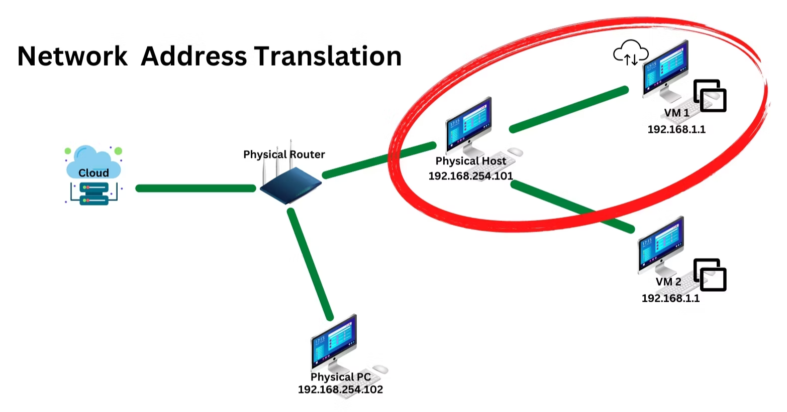
Trong KVM cung cấp một sẵn một mạng ảo NAT tên là default và có dải địa chỉ là 192.168.122.x và được kết nối với interface virbr0 trên máy host. Ta có thể thêm các mạng ảo khác bằng công cụ virt-manager:

- Tại công cụ virt-manager, chọn **Edit** -> **Connection Details** sau đó chọn vào mục Virtual Network, sẽ thấy Mạng ảo NAT default.

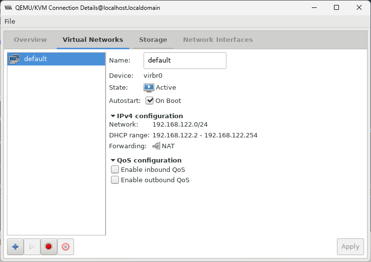
- Chọn biểu tượng  để tạo một mạng ảo, đặt tên cho mạng ảo và cấu hình địa chỉ IP và DHCP cho mạng ảo.

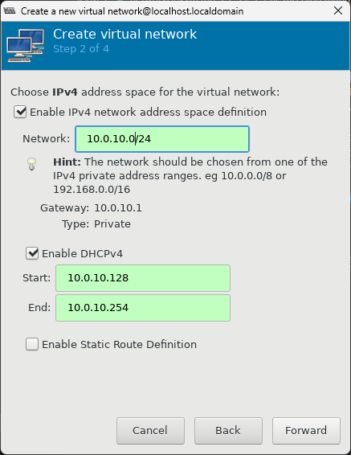
- Chọn chế độ mạng cho Mạng ảo

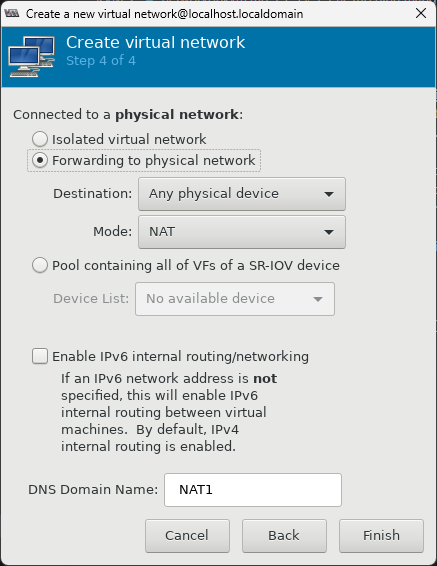
- Kiểm tra mạng ảo trên máy thực

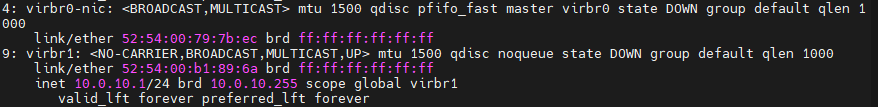
- Kết nối vào mạng ảo vào máy ảo

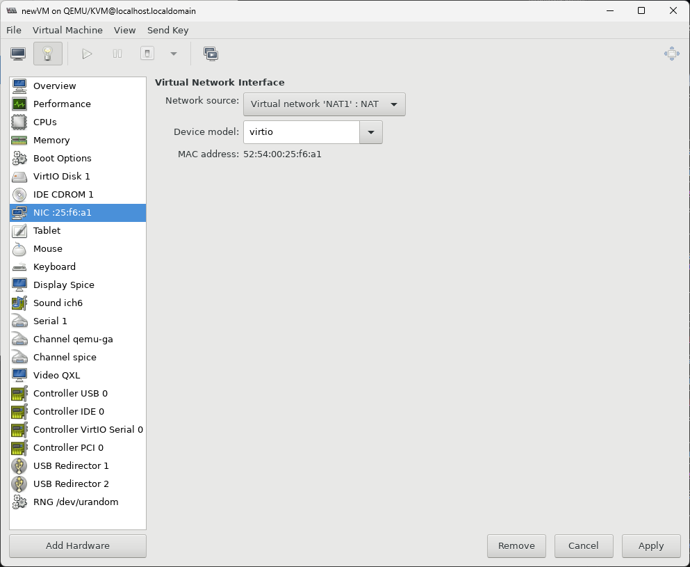

- Kiểm tra kết nối của mạng ảo trên máy ảo

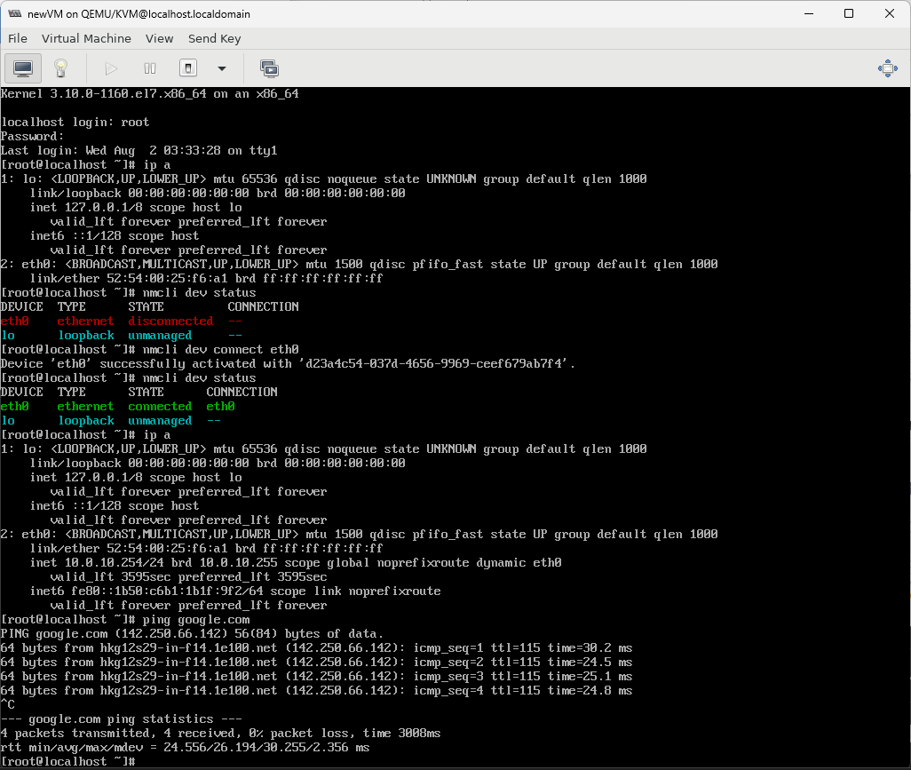
## 1.2. Host-Only
Host-only là một mô hình ánh xạ mạng tương tự như NAT, nhưng các máy bên trong mạng ảo không thể kết nối ra bên ngoài mà chỉ có thể kết nối với nhau.

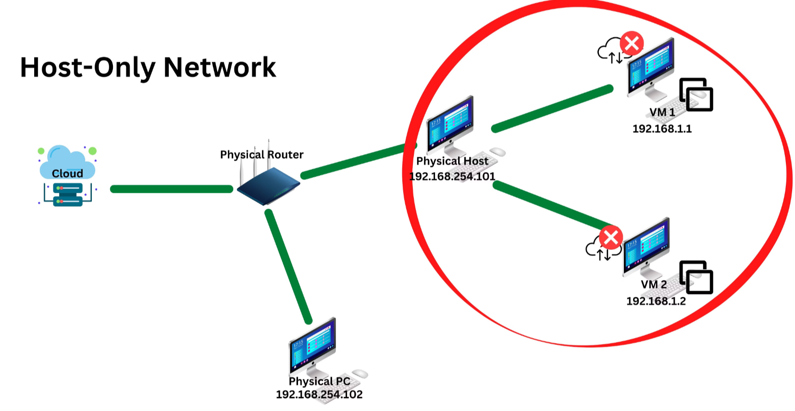
- Tạo một mạng host-only tương tự như NAT, chỉ khác ở chổ Chọn cấu hình mạng (Chọn **Isolated virtual network**)

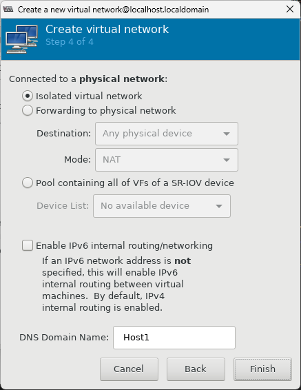
## 1.3. Bridge
Với mô hình này, các máy ảo sẽ cung một dải mạng với máy host. Các máy giao tiếp với nhau giống như trong một Local Network. Việc cấu hình Brigde tương tự như việc tạo ra một switch ảo và kết nối các máy với nhau.

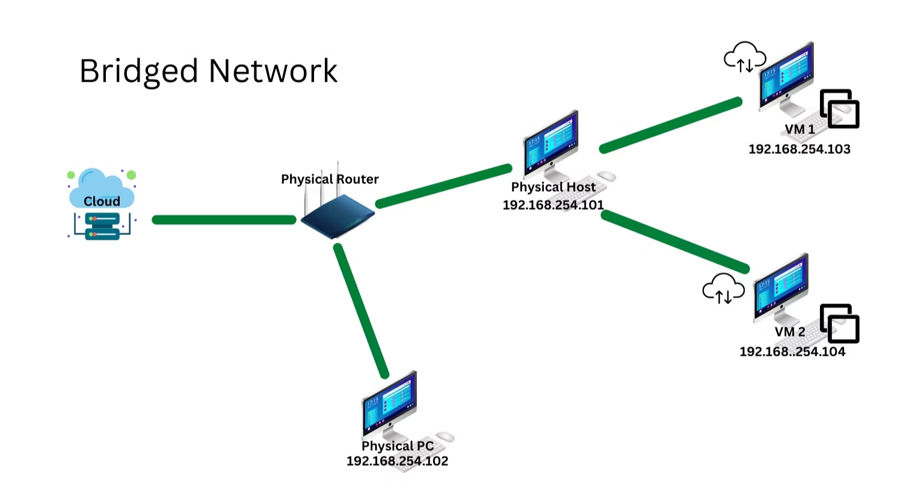

Khi cài các phần mềm ảo hoá, mặc định các card mạng sẽ được sinh ra một switch ảo, vì thế, ta chỉ cần kết nối máy ảo các máy ảo đến brigde đó.

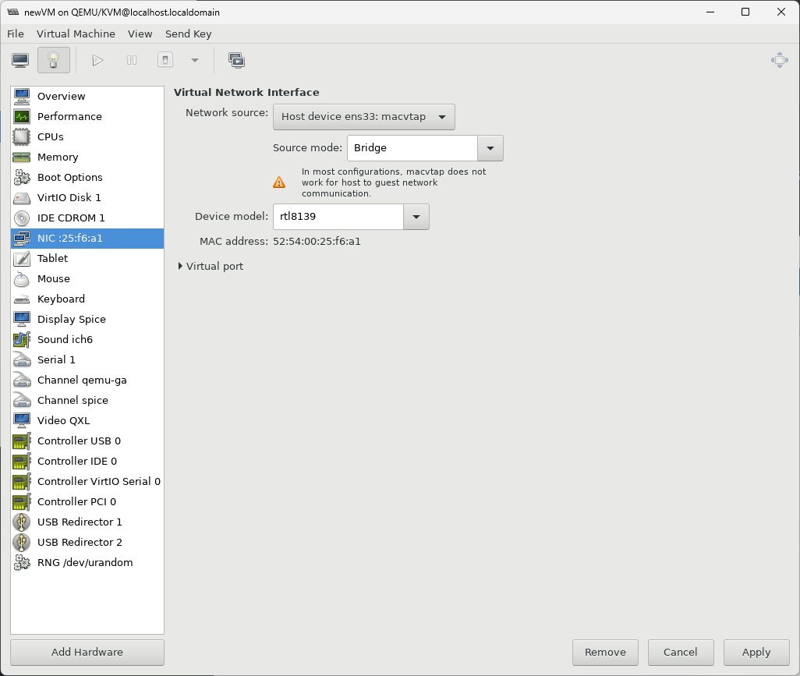

Như vậy, các máy ảo và máy host đã chung một dải mạng và có thể kết nối với nhau

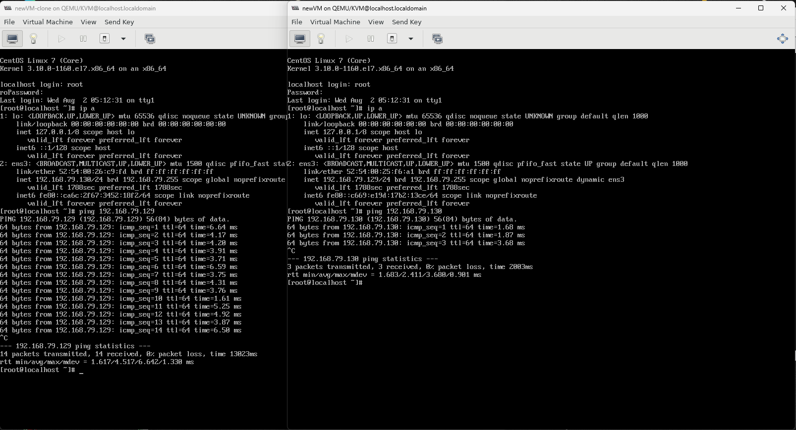
# 2. TCP Dump
## 2.1. Giới thiệu về TCP Dump
- TCPdump là phần mềm bắt gói tin được sử dụng hầu hết trên các hệ điều hành Linux. Cho phép phân tích gói mạng dữ liệu chạy dưới giao diện dòng lệnh. 

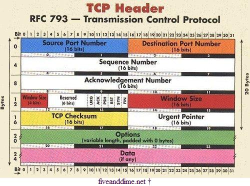
- Để cài đặt TCPdump ta sử dụng lệnh
```bash
# Ubuntu/Fedora
sudo apt-get install tcpdump
# Redhat/CentOS
sudo yum install tcpdump
```
- Sử dụng lệnh `tcpdump` cùng với từy chọn `-D` để liệt kê tất cả các interface trong máy
```bash
$ tcpdump -D
1.virbr0
2.macvtap0
3.bluetooth0 (Bluetooth adapter number 0)
4.nflog (Linux netfilter log (NFLOG) interface)
5.nfqueue (Linux netfilter queue (NFQUEUE) interface)
6.usbmon1 (USB bus number 1)
7.usbmon2 (USB bus number 2)
8.ens33
9.any (Pseudo-device that captures on all interfaces)
10.lo [Loopback]
```
## 2.2. Thực hiện lệnh tcpdump
- Một câu lệnh `tcpdump` cơ bản
```bash
tcpdump -i ens33 icmp -w ens33.pcap
```
- Trong đó:
    - Sử dụng từy chọn `-i ens33` để chỉ định interface sẽ lắng nghe và bắt gói tin
    - `icmp` chỉ định rằng chỉ bắt các gói tin ICMP
    - Sử dụng tuỳ chọn `-w ens33.pcap` để chỉ định file mà tcp dump sẽ lưu kết quả
## 2.3. Phân tích gói tin bắt được
- Gói tin bắt được sẽ có dạng như sau
```
16:58:52.214121 IP 192.168.79.129 > 192.168.79.130: ICMP echo request, seq 1, length 64
```
|Phần|Nội dung|
|---|---|
|16:58:52.214121| Dấu thời gian|
|IP|Giao thức IP|
|192.168.79.129|Địa chỉ nguồn|
|192.168.79.130|Địa chỉ đích|
|ICMP| Giao thức ICMP|
|echo request|Nội dung gói tin|
|seq 1|Sequence Number của gói tin|
|length 64|Độ dài của gói tin|
- Các gói tin của giao thức ICMP sẽ được gửi giữa 2 máy ảo và tcpdump có thể bắt được như sau
```bash
$ tcpdump -i ens33 icmp
tcpdump: verbose output suppressed, use -v or -vv for full protocol decode
listening on ens33, link-type EN10MB (Ethernet), capture size 262144 bytes
16:58:52.214121 IP 192.168.79.129 > 192.168.79.1: ICMP echo request, seq 1, length 64
16:58:52.214685 IP 192.168.79.1 > 192.168.79.129: ICMP echo reply, seq 1, length 64
16:58:53.205285 IP 192.168.79.129 > 192.168.79.1: ICMP echo request, seq 2, length 64
16:58:53.205679 IP 192.168.79.1 > 192.168.79.129: ICMP echo reply, seq 2, length 64
16:58:54.207016 IP 192.168.79.129 > 192.168.79.1: ICMP echo request, seq 3, length 64
16:58:54.208038 IP 192.168.79.1 > 192.168.79.129: ICMP echo reply, seq 3, length 64
16:58:55.208483 IP 192.168.79.129 > 192.168.79.1: ICMP echo request, seq 4, length 64
16:58:55.209560 IP 192.168.79.1 > 192.168.79.129: ICMP echo reply, seq 4, length 64
```
# 3. Cơ chế Bridge
